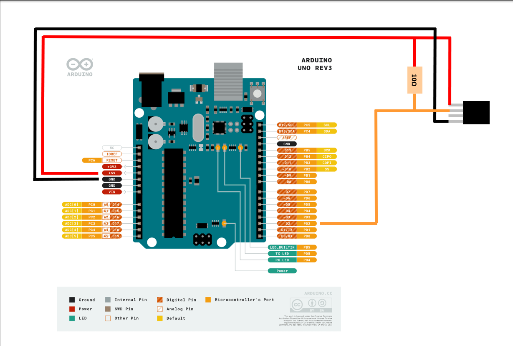
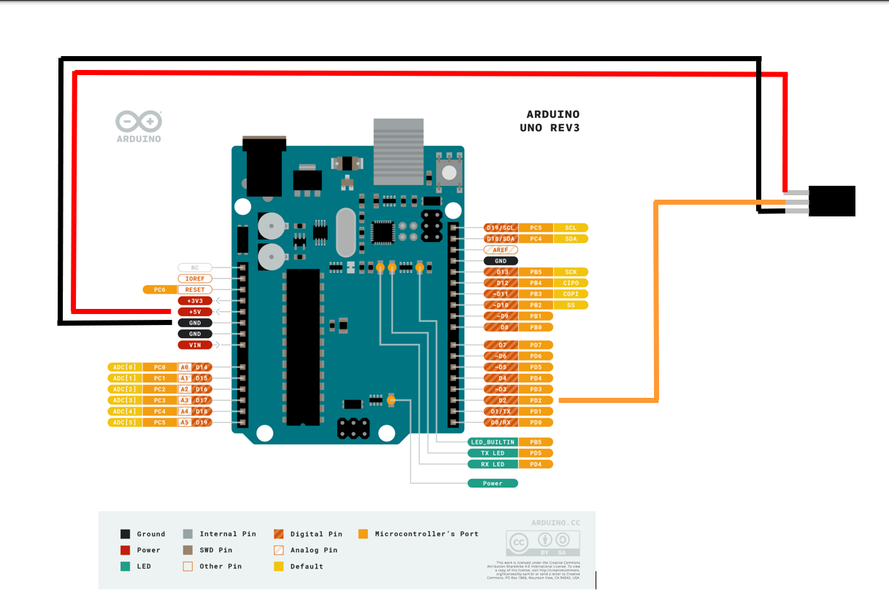

# :book: Anleitung zur Verwendung des DHT11 mit dem Arduino Uno :de:

## :dart: Ziel
Wir verbinden den **DHT11**-Temperatursensor mit einem **Arduino Uno**, um die Temperaturwerte jede Sekunde zu erfassen und über die serielle Schnittstelle auszugeben.

## :wrench::clipboard: Benötigte Materialien
Hier eine Tabelle, in die du später die Preise eintragen kannst:

| **Komponente**             | **Benötigte Anzahl** | **Preis (Stück)** | **Gesamtpreis** | **Link** |
|----------------------------|----------------------|-------------------|-----------------|----------|
| Arduino Uno Rev3 | 1|28,58€|28,58€|[Hier erhältlich](https://store.arduino.cc/en-de/collections/boards-modules/products/arduino-uno-rev3)
| USB Kabel (USB A --> USB B)|1|1,99€|1,99€|[Hier erhältlich](https://www.amazon.de/ASSMANN-93596-Anschlusskabel-USB-B-Stecker/dp/B004SO1VPM/ref=sr_1_3?__mk_de_DE=%C3%85M%C3%85%C5%BD%C3%95%C3%91&crid=1ABAJZFJ28MSS&dib=eyJ2IjoiMSJ9.BQFjBz_cPdd5zjiKUuTBvD-OQ74wvYxFffJDvC68wUP8ZaB888AduP_kptGXzsJ-rcNl5qiAxUWPNYwuHzOwJLsPeOU2b_8QMbGXRKJSIHdyzap4KcEyQoMpHj15qJCF3HIVvvHL8JCtPXJUvw4EDj765c1PQWnvSW-ACpmpR2-DwmjgiuQ7YR3pD-5FPjANBYmx6qwcaPAHV-oyuPcXZfwYxvkk5KtrlEKOP_4GFtR5amfp582Z3KkQ-DnojwLK8FM2HUHN6fpj6wrVDvjRzMuiXgDb6x1CrLumniM_uOM.-2RYJQdYKHs43NHms_6Hk-zePc39UIKB97FVrJIGXEI&dib_tag=se&keywords=USB+A+auf+b&qid=1728509050&s=industrial&sprefix=usb+a+auf+b%2Cindustrial%2C72&sr=1-3)
| DHT11-Sensor (3-Pin oder 4-Pin) | 1|4,99€|4,99€|[Hier erhältlich](https://www.az-delivery.de/products/5-x-dht11-temperatursensor?variant=19798662414432)
| Jumperkabel| 3 bis 5|13,99€ (Set)|13,99€|[Hier erhältlich](https://www.amazon.de/Canzoon-Female-Female-Male-Female-%C3%BCberbr%C3%BCckungsdraht-Schaltungstest/dp/B09BYT3JBB?source=ps-sl-shoppingads-lpcontext&ref_=fplfs&psc=1&smid=A1VTU4MWOPYK48)
| Breadboard (optional)|1|8,49€|8,49€|[Hier erhältlich](https://www.amazon.de/Elegoo-Breadboard-Solderless-Distribution-Verbindungsbl%C3%B6cke/dp/B01MCRZFE5/ref=sr_1_5?crid=27M4UPUUSN1CG&dib=eyJ2IjoiMSJ9.c5SsBAW-HhcN-xV9GsJ92DiBKeD_5p89pmkumeHcm8xvT-0iNJQpwzw0Ys0BWsAeCs9kmehLUyeYyDrSiIH51QfGLeDwTxAa98bnYPI_R_KqE8bNSiv6-5V6zIN46kB6uk3N_MvQI2Ik4vBbCI2UQXQAblnl5GDgQ2F43jVc-Ivf5e26PFvwzJCHxPlBWCZ-5n2twNj80KcKCoe214CmMfxSAWLMrqeS8qC1QXRmMQAgX8SUz8ilKJh8UID_rQMe67XJj6xRGTjCS0NiLeSBYmavhs8ka6ZIsPl8D7SnyPA.2EaXKejd-1y56kXBX942gmWSb9rQpnJ5Z7j4EugEqgw&dib_tag=se&keywords=breadboard&qid=1728508809&s=industrial&sprefix=bread%2Cindustrial%2C77&sr=1-5)
| 10kΩ Widerstand (nur bei 4-Pin)|1|5,25€|5,25€|[Hier erhältlich](https://www.amazon.de/Metallfilm-Fest-Durchgangsbohrungs-widerst%C3%A4nde-Strombegrenzung-Rohs-zertifiziert/dp/B08QS327LK/ref=sr_1_11?__mk_de_DE=%C3%85M%C3%85%C5%BD%C3%95%C3%91&crid=JQ9MP1KQYD3D&dib=eyJ2IjoiMSJ9.yrPrg7tz0kBny2NZoxOf_IcdQkDv3Po7k9jFIY7thr966QqvyksHqqJ9V9mvohBrgZu74Jg54UtkjngI_zJNpH5uZfY4fAsO7xAKLd9KJBBZee6wChVXYqLNCIS4Fn_ZnVMX7cAs2l82IMElt-zflTA0Vb-r6wlKEo_yVmE0krEv4FaEPReIVy0rdkvNXOQr2O1_RUnSzbwTSeCdo-xLscyiCe2AaX48YbeGmzokabB-TCYvGgjYw1ghJTx7_g8MP90Ni7pM9QrDF3LVfyHeDWKHZDit5Tqk7JFMrgnnkW4.H03yt8XVzkRSo4yBIazhu-UwKTx5UjGHm54PXHvHl-Y&dib_tag=se&keywords=10%2Bohm%2Bwiderstand&qid=1728508894&s=industrial&sprefix=10%2Bohm%2Bwiderstand%2Cindustrial%2C72&sr=1-11&th=1) 
|||**Gesamt:**|**63,29€**

> :bulb:**Hinweis:** Du kannst den 3-Pin- oder 4-Pin-DHT11 verwenden, die Verdrahtung unterscheidet sich nur geringfügig. Beide Varianten liefern dieselben Temperatur- und Feuchtigkeitsdaten.

## :floppy_disk: Software-Download und Tutorials

### Empfohlene Software für Anfänger :baby::
Für Anfänger ist die Arduino IDE die beste Wahl, da sie speziell für die Programmierung von Arduino-Boards entwickelt wurde und eine einfache Benutzeroberfläche bietet.

- [Arduino IDE herunterladen](https://www.arduino.cc/en/software)
  
### Alternative: Visual Studio Code für fortgeschrittene Nutzer :muscle::
Wer bereits Erfahrung mit Programmierung hat oder eine leistungsfähigere Entwicklungsumgebung nutzen möchte, kann Visual Studio Code in Kombination mit der Arduino-Erweiterung verwenden.

- Anleitung zur Verwendung von VSCode mit Arduino: [VSCode Arduino Tutorial](www.google.com)

> :bulb:**Hinweis:** Diese Anleitung bezieht sich auf die Arduino IDE. Falls du dir unsicher sein solltest welche Software du verwenden willst, wähle die Arduino IDE.

## :pencil: Schritte für den Anschluss des DHT11 an den Arduino Uno

### 1. :scroll: Vorbereitung der Arbeitsumgebung
1. Stelle sicher, dass du alle benötigten Materialien hast.
2. Öffne die Arduino IDE auf deinem Computer und vergewissere dich, dass du den richtigen **Port** und das **Board** (Arduino Uno) unter **Werkzeuge** auswählst.

### 2. :electric_plug: Verdrahtung des DHT11-Sensors

> :bulb:**Hinweis:** Die Belegung der Pins des DHT11-Sensors kann je nach Hersteller variieren. Inforimiere dich über den DHT11-Sensor den du verwendest und passe die Verdrahtung gegebenenfalls an.

#### Für den **4-Pin-DHT11**:
- Der 4-Pin-DHT11 hat vier Anschlüsse: **VCC, DATA, NC, GND**.
- Ein **10kΩ-Pullup-Widerstand** wird zwischen **VCC** und **DATA** benötigt, um die Datenkommunikation zu stabilisieren.

##### Schritte:
1. Verbinde den **VCC**-Pin des DHT11 (1. Pin) mit dem **5V**-Pin des Arduino.
2. Verbinde den **GND**-Pin des DHT11 (4. Pin) mit dem **GND**-Pin des Arduino.
3. Verbinde den **DATA**-Pin des DHT11 (2. Pin) mit dem **Digitalen Pin 2** des Arduino.
4. Setze einen **10kΩ-Pullup-Widerstand** zwischen **VCC** und **DATA** (Pins 1 und 2) auf dem Breadboard.

### :electric_plug: **Schaltplan für 4-Pin DHT11:**


#### Für den **3-Pin-DHT11**:
- Der 3-Pin-DHT11 kombiniert die Funktionen des 4-Pin-Sensors und benötigt keinen zusätzlichen Widerstand.

##### Schritte:
1. Verbinde den **VCC**-Pin des DHT11 (1. Pin) mit dem **5V**-Pin des Arduino.
2. Verbinde den **GND**-Pin des DHT11 (3. Pin) mit dem **GND**-Pin des Arduino.
3. Verbinde den **DATA**-Pin des DHT11 (2. Pin) mit dem **Digitalen Pin 2** des Arduino.

### :electric_plug: **Schaltplan für 3-Pin DHT11:**


### 3. :book: Installiere die DHT-Bibliothek
Um mit dem DHT11 zu arbeiten, benötigst du die Adafruit DHT-Sensorbibliothek.

#### Schritte:
1. Öffne die **Arduino IDE**.
2. Gehe zu **Sketch > Bibliothek einbinden > Bibliotheken verwalten**.
3. Suche nach "DHT" und wähle die Bibliothek von **Adafruit** aus.
4. Klicke auf **Installieren**.

---

## 4. :computer: Programmieren des Arduino – Schritt-für-Schritt-Erklärung des Codes

> :bulb:**Hinweis:** Der folgende Code liest die Temperaturdaten vom DHT11-Sensor aus und zeigt diese jede Sekunde im seriellen Monitor an. Hier findest du den vollständigen Code mit einer detaillierten Erklärung:

```cpp
#include "DHT.h"  // Importiere die DHT Bibliothek, die uns den Zugriff auf den DHT11 Sensor ermöglicht.

#define DHTPIN 2     // Definiert den digitalen Pin, an den der DHT11-Sensor angeschlossen ist (in diesem Fall Pin 2).
#define DHTTYPE DHT11   // Definiert den Sensortyp (DHT11). Falls du einen DHT22 verwenden würdest, müsstest du hier DHT22 angeben.

DHT dht(DHTPIN, DHTTYPE);  // Erstellt ein Objekt der DHT Klasse, das den Pin und den Sensortyp verwendet.

void setup() {
  Serial.begin(9600);  // Initialisiert die serielle Kommunikation mit 9600 Baud (Geschwindigkeit der Datenübertragung).
  dht.begin();  // Initialisiert den DHT-Sensor. Ohne diesen Befehl funktioniert der Sensor nicht.
}

void loop() {
  delay(1000);  // Verzögert die Ausführung des Codes um 1 Sekunde (1000 Millisekunden), sodass der Sensor nur einmal pro Sekunde abfragt.

  float temperature = dht.readTemperature();  // Liest die Temperatur in Celsius vom Sensor und speichert sie als Gleitkommazahl (float) in der Variable "temperature".

  // Überprüft, ob die Messung erfolgreich war:
  if (isnan(temperature)) {  
    // Wenn der Sensor keine gültigen Daten liefert (z.B. wenn der Sensor falsch verdrahtet ist oder nicht antwortet),
    // gibt der Code eine Fehlermeldung aus.
    Serial.println("Fehler beim Auslesen des DHT-Sensors!");
    return;  // Stoppt die Ausführung der Funktion, wenn keine Daten gelesen werden konnten.
  }

  // Wenn die Daten erfolgreich ausgelesen wurden, gibt der Arduino die Temperatur auf dem seriellen Monitor aus:
  Serial.print("Temperatur: ");
  Serial.print(temperature);  // Gibt die gemessene Temperatur ohne Zeilenumbruch aus.
  Serial.println(" °C");  // Gibt das Grad Celsius-Symbol aus und bricht die Zeile um.
}
```

## :interrobang: Erklärung der einzelnen Codeabschnitte:

1. `#include "DHT.h"`
   - Dieser Befehl importiert die DHT-Bibliothek, die alle Funktionen bereitstellt, um Daten vom DHT11-Sensor auszulesen.
2. `#define DHTPIN 2`
   - Hier definierst du den digitalen Pin, an dem der DATA-Pin des DHT11-Sensors angeschlossen ist. In diesem Fall verwenden wir Digital Pin 2.
3. `#define DHTTYPE DHT11`
   - Da wir einen DHT11-Sensor verwenden, wird der Sensortyp auf DHT11 gesetzt. Die DHT-Bibliothek unterstützt auch den DHT22, aber den würden wir hier nicht verwenden.

4. `DHT dht(DHTPIN, DHTTYPE);`
   - Dies erstellt ein DHT-Objekt mit dem Namen dht. Dieses Objekt ermöglicht uns den Zugriff auf alle Funktionen des DHT-Sensors, wie das Lesen der Temperatur und Feuchtigkeit.
5. `void setup()`
   - Die `setup()`-Funktion wird einmalig beim Start des Arduino-Boards ausgeführt. Hier initialisieren wir die serielle Kommunikation mit dem Befehl Serial.begin(9600);, damit wir die Sensordaten später auf dem PC über den seriellen Monitor anzeigen können.
   - `dht.begin();` initialisiert den DHT-Sensor und bereitet ihn auf das Auslesen von Daten vor.
6. `void loop()`
    - Die `loop()`-Funktion wird kontinuierlich wiederholt. Hier läuft unser Programm zur Messung und Ausgabe der Temperaturdaten.
    - `delay(1000);` pausiert die Ausführung für 1 Sekunde, sodass die Temperatur einmal pro Sekunde abgerufen wird.
    - `float temperature = dht.readTemperature();` liest die aktuelle Temperatur in Grad Celsius vom DHT11-Sensor und speichert sie in der Variable temperature.
7. Fehlerbehandlung:
    - `if (isnan(temperature)) { ... }` prüft, ob der Sensor eine gültige Temperatur gemeldet hat. `isnan()` bedeutet "is not a number". Sollte ein Fehler auftreten, wird eine Fehlermeldung ausgegeben.
8. Ausgabe der Temperatur:
    - `Serial.print("Temperatur: ");` gibt den Text "Temperatur: " auf dem seriellen Monitor aus.
    - `Serial.print(temperature);` gibt die gemessene Temperatur aus.
    - `Serial.println(" °C");` gibt das Grad-Symbol aus und startet eine neue Zeile.

## 5. :rocket: Hochladen des Sketches auf den Arduino
1. Verbinde den Arduino Uno mit deinem Computer über ein **USB-Kabel**.
2. Klicke auf den **Upload-Button** (Pfeil nach rechts) in der Arduino IDE, um den Code auf den Arduino hochzuladen.
3. Öffne den **Serial Monitor** (Werkzeuge > Serieller Monitor) in der Arduino IDE, um die Temperaturwerte in Echtzeit zu sehen. Diese werden jede Sekunde aktualisiert.

## 6. 🧪 Testen und Verwenden des Serial Monitors

Nachdem du den Code auf den Arduino hochgeladen hast, kannst du die gemessenen Temperaturen im Serial Monitor anzeigen.

**Schritte, um den Serial Monitor zu öffnen:**
1. In der Arduino IDE, gehe zu Werkzeuge > Serieller Monitor oder klicke auf das Lupensymbol oben rechts in der IDE.
2. Ein neues Fenster öffnet sich – der Serial Monitor.
3. Stelle sicher, dass die Baudrate im Serial Monitor auf 9600 eingestellt ist (das kannst du im Dropdown-Menü unten rechts im Serial Monitor ändern), da dies die gleiche Baudrate ist, die wir im Code mit Serial.begin(9600); definiert haben.
4. Nun solltest du im Serial Monitor die Temperaturdaten sehen, die jede Sekunde aktualisiert werden. Die Ausgabe sieht ungefähr so aus:
```txt
Temperatur: 25.30 °C
Temperatur: 25.40 °C
Temperatur: 25.50 °C
```

**:bulb: Hinweise:**
- Wenn du keine Daten siehst, überprüfe die Verkabelung des DHT11-Sensors oder ob der richtige Port in der Arduino IDE ausgewählt ist.
- Achte darauf, dass die Baudrate korrekt eingestellt ist (9600 Baud).

# :checkered_flag: Zusammenfassung
Mit dieser Anleitung hast du den DHT11-Sensor erfolgreich mit einem Arduino Uno verbunden, um die Temperaturdaten jede Sekunde auszulesen. Die wichtigsten Unterschiede zwischen der 3-Pin- und 4-Pin-Variante des DHT11 liegen in der Anzahl der Anschlüsse und dem optionalen Pullup-Widerstand für die 4-Pin-Version. Beide Varianten liefern die gleichen Messdaten und können mit dem gleichen Arduino-Code betrieben werden.

Für Anfänger empfehlen wir die **Arduino IDE** aufgrund ihrer Benutzerfreundlichkeit, während fortgeschrittene Nutzer auch auf **Microsofts Visual Studio Code** umsteigen können, um von den erweiterten Funktionen zu profitieren.
